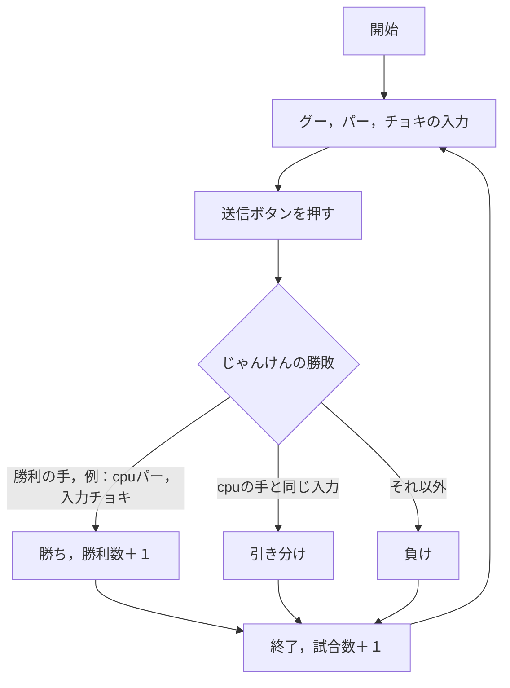
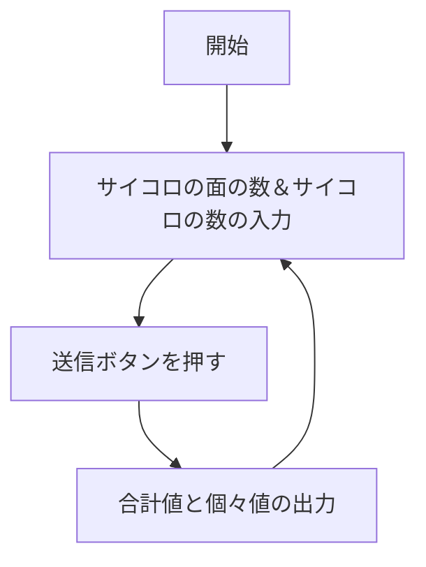
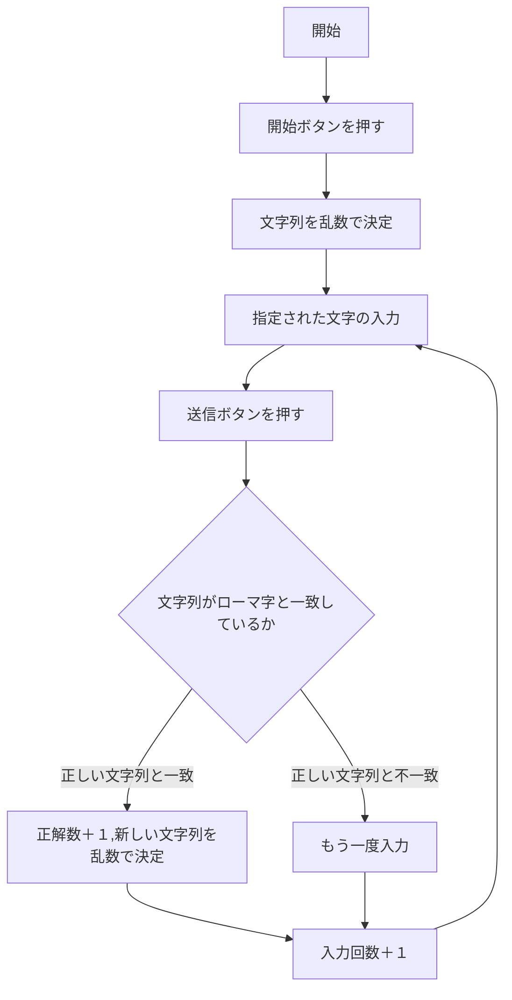

# webpro_06
## このプログラムについて
### ファイル一覧
ファイル名 | 説明|
-|-
app5.js | プログラム本体
/public/index.html | 目次
/public/janken.html | じゃんけんの開始画面
/views/janken.ejs| じゃんけんのテンプレート
/public/dice.html | 複数・多面対応サイコロの開始画面
/views/dice.ejs|複数・多面対応サイコロのテンプレート
/public/sushida.html | 寿司打の開始画面
/views/sushida.ejs| 寿司打のテンプレート


1. ```app5.js``` を起動する
1. Webブラウザで```localhost:8080/public/index.html```にアクセスする
1. 好きなリンクを選ぶ（じゃんけん，寿司打，多面・複数対応サイコロ）
1. それらで遊ぶ


<!-- 
注意：項目名として「end」は使用できない
-->

じゃんけんのフォローチャート


複数・多面対応サイコロのフォローチャート


寿司打サイコロのフォローチャート
