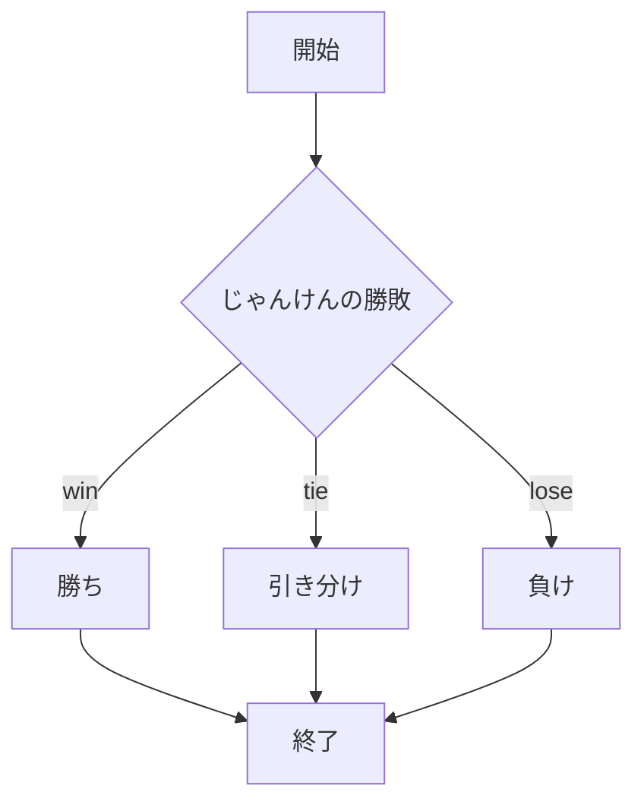

# webpro_06
## このプログラムについて
### ファイル一覧
ファイル名 | 説明|
-|-
app5.js | プログラム本体
public/janken.html | じゃんけんの開始画面
/views/janken.ejs| じゃんけんのテンプレート

1. ```app5.js``` を起動する
1. Webブラウザで```localhost:8080/public/janken.html```にアクセスする
1. 自分の手を入力する

<!-- 
注意：項目名として「end」は使用できない
-->


